# CashFloat

## Overview
**CashFloat** is an iOS application designed to streamline cash management and inventory tracking for small businesses or individual users. Built with Swift and UIKit, the app provides a user-friendly interface to handle product management, inventory restocking, and transaction history seamlessly.

## Purpose
The CashFloat app aims to simplify the process of tracking sales and managing stock levels. It is ideal for vendors, small business owners, or anyone who wants to maintain an organized approach to handling cash transactions and product inventory.

## Features
- **Product Management**: Easily add and view products with detailed information such as name, price, and stock quantity.
- **Inventory Restocking**: Restock products efficiently by entering the desired quantity, ensuring you never run out of stock.
- **Transaction History**: Keep a log of all transactions made, helping users monitor sales over time.
- **Interactive UI**: Intuitive and responsive interface that enhances user experience.

## Technologies Used
- **Swift**: For developing the app logic and UI.
- **UIKit**: For building the app's interface.
- **Xcode**: The integrated development environment (IDE) for iOS app development.

## Adding a Product
-Navigate to the Add Product screen.
-Fill in the product name, price, and initial stock quantity.
Tap Save to add the product to your inventory.
## Restocking Inventory
Go to the Restock section.
Select the product you wish to restock.
Enter the quantity to be added and press the Restock button.
Confirm the action to update the stock levels.
## Viewing Transaction History
Access the History section to view all past transactions, including purchases and restocks.

## Installation

Clone the repository: git clone https://github.com/ManpreetKGulati/CashFloat.git
Open the project in Xcode (or Android Studio for a cross-platform app).
Build and run the app on a simulator or physical device.

## Screenshots

### Purchasing a product

  
  

### Quantity decreased once bought and reset

  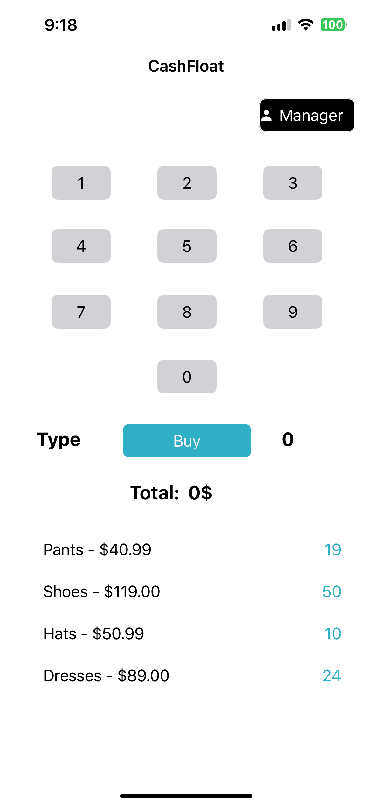

### ManagerController

  

### When History is selected

  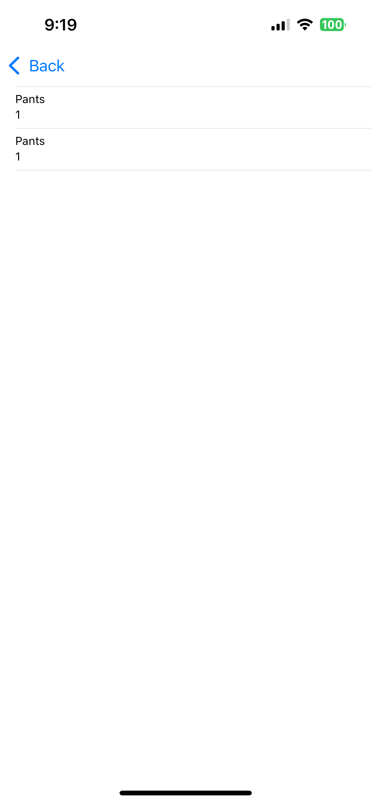
   

### When Restock is selected

  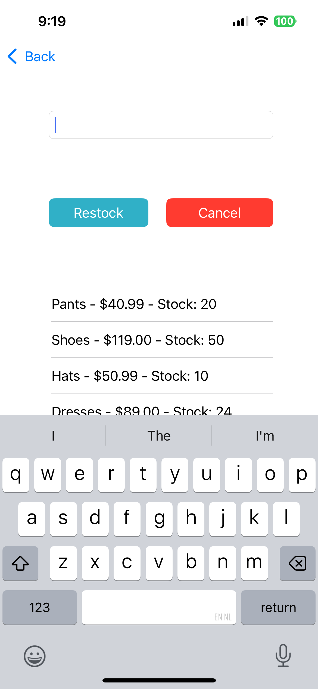
   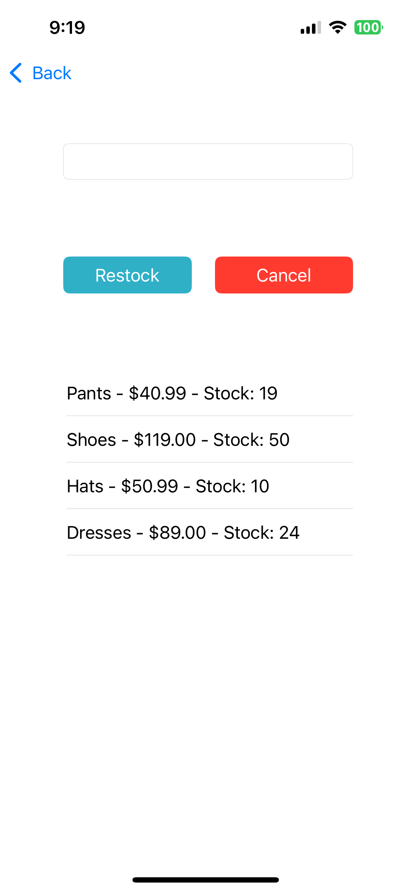
   
   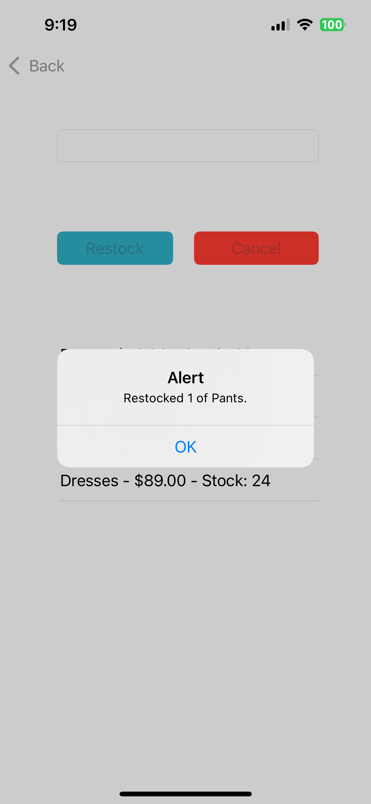

### Reflected on Main Page

   

### Validations

  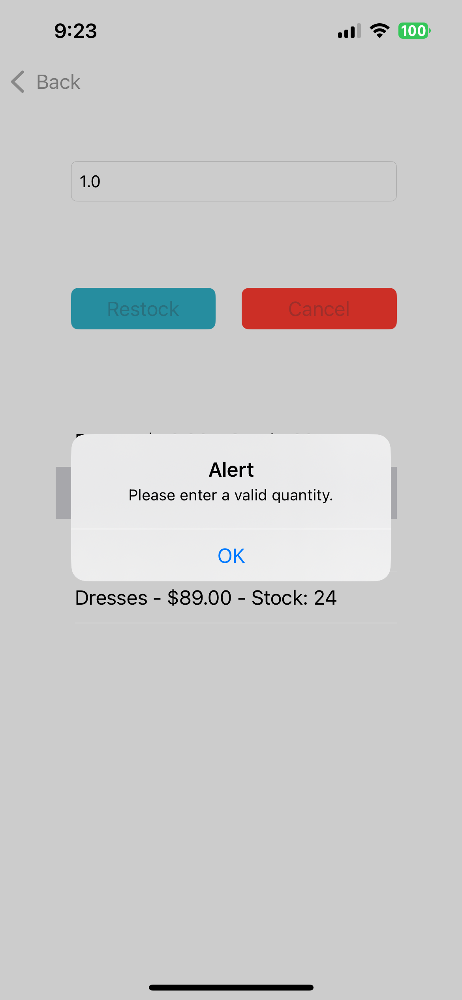
  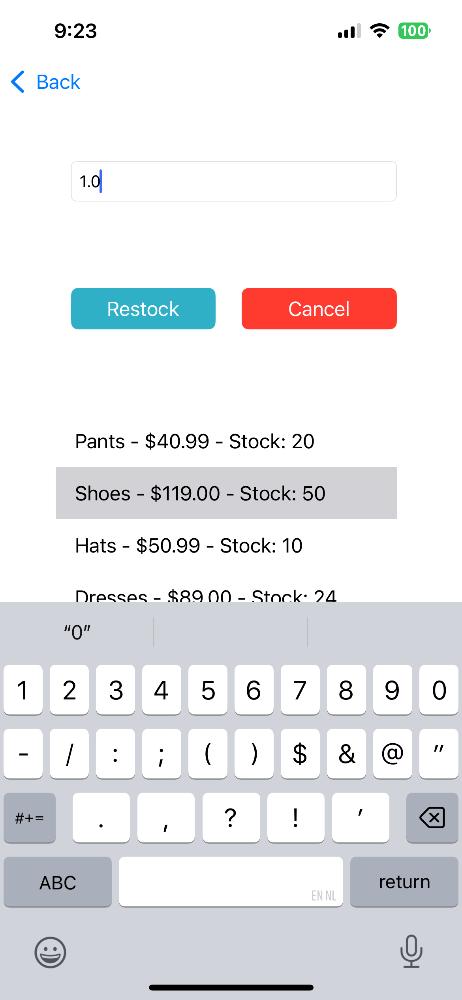
  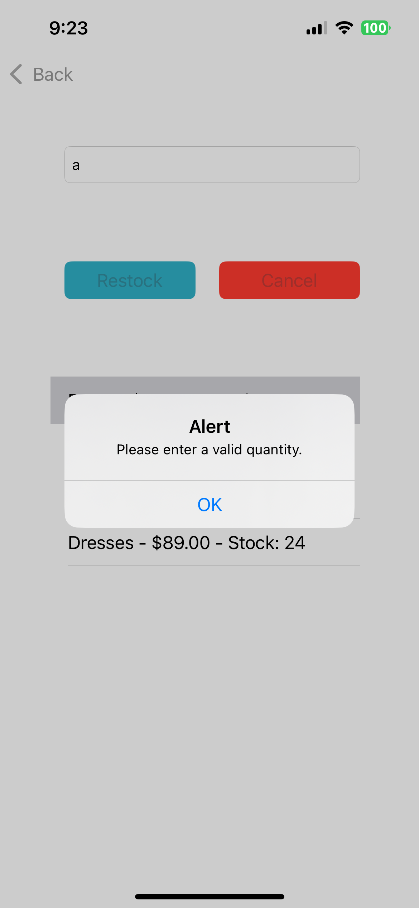
  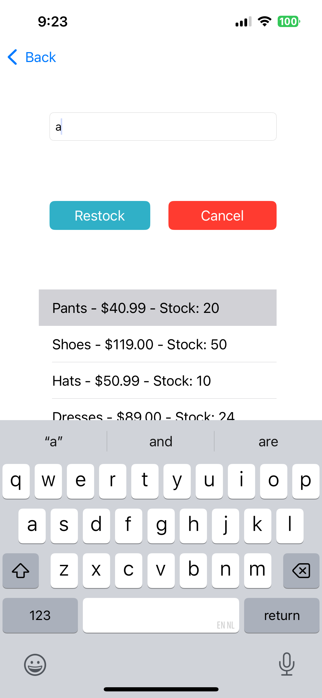
  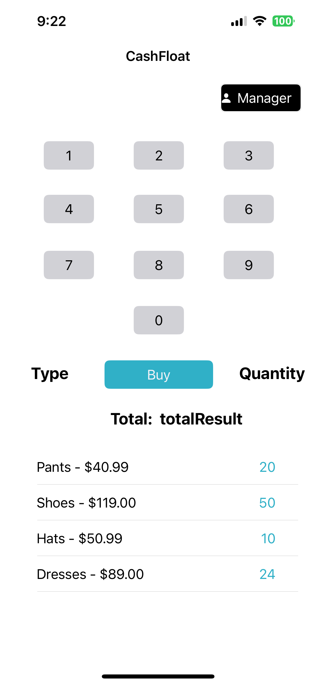
  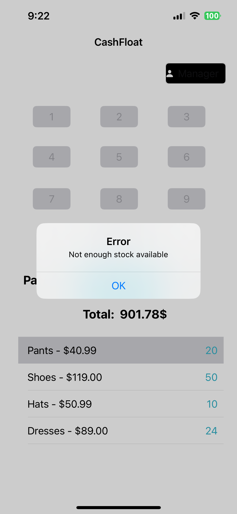
  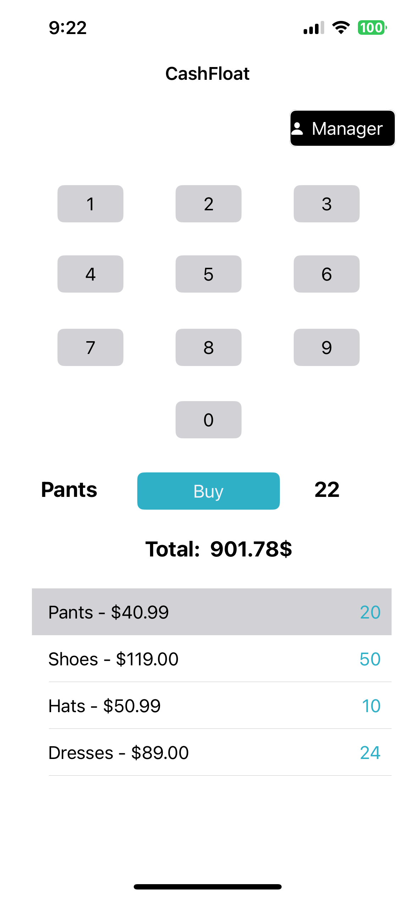
  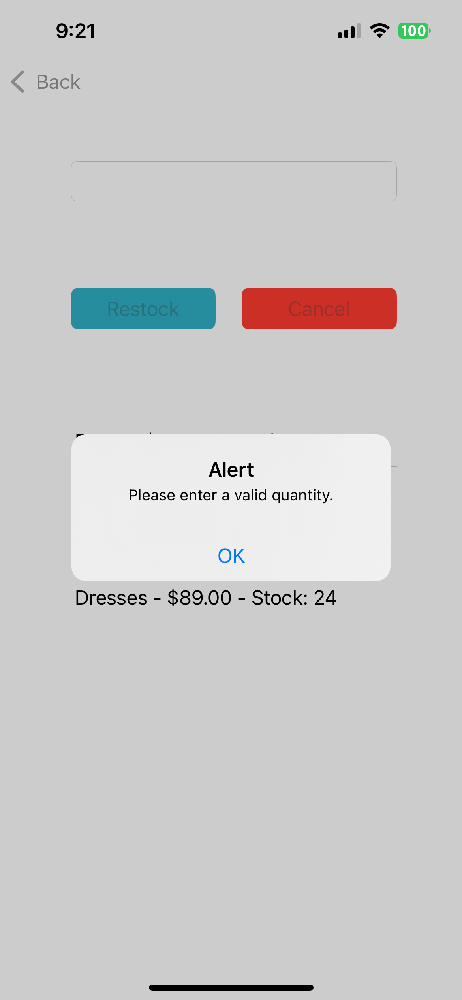

